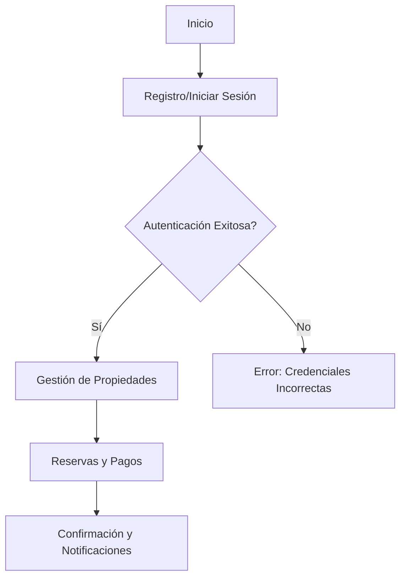
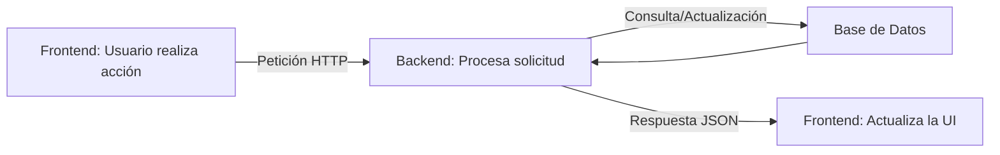

# PayNStay Frontend

Este es el repositorio del proyecto **PayNStay Frontend**, que proporciona la interfaz de usuario para la plataforma PayNStay. Este sistema está diseñado para ofrecer una experiencia amigable y eficiente para la gestión de alojamientos y pagos.


   
   

## Características

- **Interfaz de Usuario Intuitiva:** Diseño claro y fácil de usar.
- **Integración Backend:** Conexión fluida con los servicios backend.
- **Responsive Design:** Compatible con dispositivos móviles y de escritorio.
- **Funcionalidades Principales:**
  - Registro e inicio de sesión de usuarios.
  - Gestión de propiedades y pagos.
  - Visualización de reservas.

## Requisitos Previos

Asegúrate de tener instalado lo siguiente en tu máquina:

- [Node.js](https://nodejs.org/) (v16 o superior)
- [npm](https://www.npmjs.com/) o [yarn](https://yarnpkg.com/)

## Instalación

1. Clona este repositorio:
   ```bash
   git clone https://github.com/tu-usuario/PayNStay-Frontend.git
   ```

2. Navega al directorio del proyecto:
   ```bash
   cd PayNStay-Frontend
   ```

3. Instala las dependencias:
   ```bash
   npm install
   ```

## Ejecución

Para ejecutar el proyecto en un entorno de desarrollo:

```bash
npm start
```

El servidor de desarrollo estará disponible en `http://localhost:3000`.

## Construcción para Producción

Para crear una versión optimizada del proyecto:

```bash
npm run build
```

Los archivos optimizados estarán disponibles en el directorio `build/`.

## Estructura del Proyecto

```
PayNStay-Frontend/
├── build/              # Archivos optimizados para producción
├── src/                # Código fuente del proyecto
│   ├── components/     # Componentes reutilizables
│   ├── pages/          # Páginas principales
│   ├── styles/         # Archivos de estilo
│   └── App.js          # Punto de entrada principal
├── public/             # Archivos públicos
├── package.json        # Configuración del proyecto
└── README.md           # Documentación
```

## Detalles del Código

El código está organizado de manera modular para facilitar su mantenimiento y escalabilidad:

- **Components:** Incluye componentes reutilizables como formularios, botones y otros elementos de la interfaz.
- **Pages:** Contiene las vistas principales de la aplicación, como la página de inicio, detalles de propiedades y gestión de usuarios.
- **Styles:** Archivos CSS organizados para mantener consistencia visual en toda la aplicación.
- **App.js:** El punto de entrada principal de la aplicación donde se configuran las rutas y el contexto global.

## Página 


## Flujo de Funcionamiento

El siguiente diagrama describe el flujo básico de funcionamiento de la aplicación:

1. **Usuario accede al sitio web:**
   - Se muestra la página principal con opciones para registro o inicio de sesión.

2. **Inicio de sesión/Registro:**
   - El usuario introduce sus credenciales o crea una cuenta.
   - La información se envía al backend para autenticación.

3. **Gestión de Propiedades:**
   - Una vez autenticado, el usuario puede añadir, editar o eliminar propiedades.

4. **Reservas y Pagos:**
   - Los clientes pueden realizar reservas.
   - Los datos de pago se procesan mediante una API segura.

5. **Confirmación y Notificaciones:**
   - El sistema confirma la operación y envía notificaciones relevantes.



## Conexión al Backend

El siguiente flujo describe cómo el frontend interactúa con el backend:

1. **Solicitud del Cliente:**
   - El usuario realiza una acción en el frontend (por ejemplo, iniciar sesión o añadir una propiedad).

2. **Envía una Petición al Backend:**
   - El frontend envía una solicitud HTTP (usando `fetch`) al servidor backend.

3. **Procesamiento del Backend:**
   - El backend valida y procesa la solicitud, accediendo a la base de datos si es necesario.

4. **Respuesta del Backend:**
   - El servidor devuelve una respuesta con los datos solicitados o un mensaje de estado.

5. **Actualización de la UI:**
   - El frontend actualiza la interfaz de usuario basándose en la respuesta del servidor.


## Authors

* **Erika Juliana Castro Romero** - [Juc28](https://github.com/Juc28)
* **Alexandra Cortes Tovar** - [alexandrac1420](https://github.com/alexandrac1420)
* **Mariana Pulido Moreno** - [MPulidoM](https://github.com/MPulidoM)
* **José Ricardo Vásquez Vega** - [Richi025](https://github.com/Richi025)
* **Juan Sebastián Vásquez Vega** - [Sebasvasquezz](https://github.com/Sebasvasquezz)


